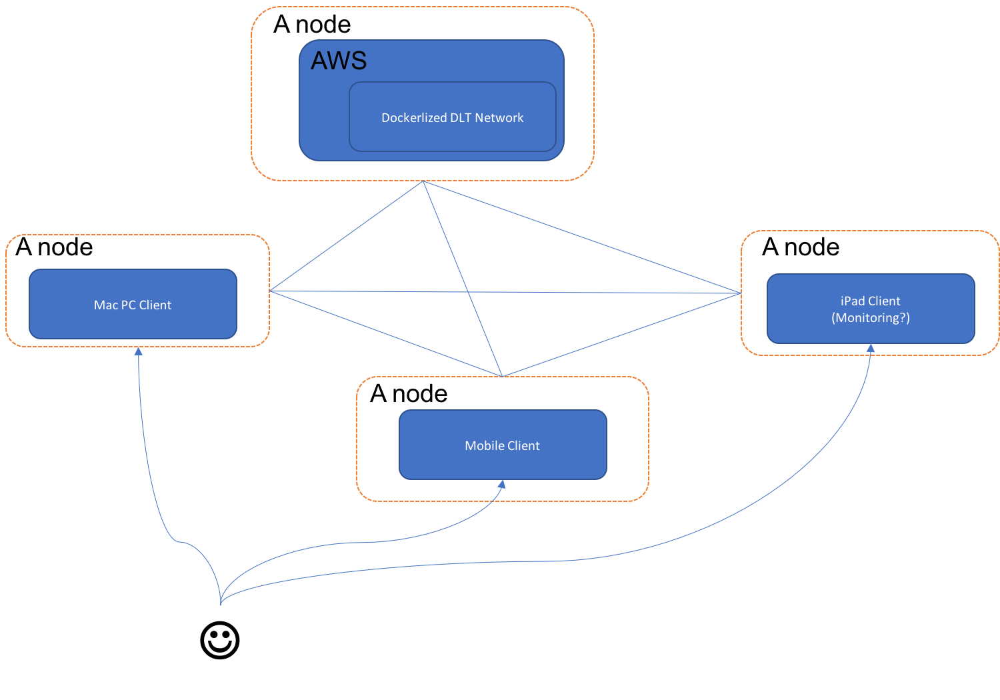
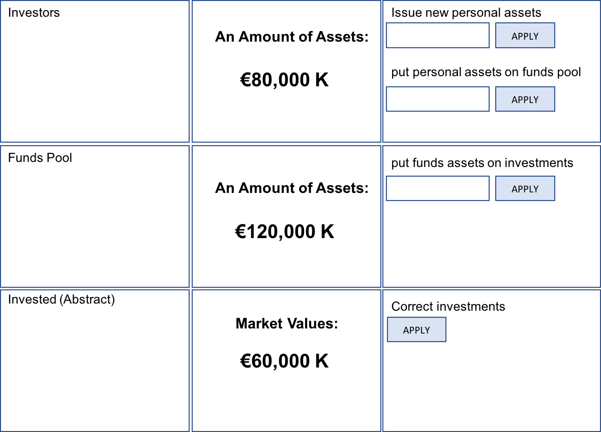

# Private Equity Assets Management with Distributed Ledger Technology Stacks
An example of distributed ledger use-case as a prototype system on a purpose to answer high level questions

## High level Questions

* Security
* Scalability
* Comparison of key benefits over conventional centralized system
* Development efficiency
* High level system architecture
* How deployment works? On AWS? isn’t that centralized?
  * -> if not, how one node can find other nodes in the same DLT netowrk?
  * -> How monitoring works?

## Technical Questions / Perspective

### SDK
* Things SDK can do?
  * Create channels
  * Join to channels
  * Init / instantiate chaincodes
  * invoke chaincodes (make a query)

### Fabric
* How exactly data is stored?
* How exactly consensus works? (adding data)
* How exactly reading query works?
* How exactly channel works?
* How exactly MSP / CA-Agent work?

### General/Common
* Testing Guideline?
* Fundamental Go Software Language?
* Chaincode writing guideline?
* Client Application structure?

## High Level Systems Architecture

## MVP1

## TODOs
* Define smart contracts
  * Data Model
  * Transactions
* Build DLT network with Fabric framework
* Build GUIs on Client Application with client SDK
* Product Development Management – Github / JIRA / Confluence
